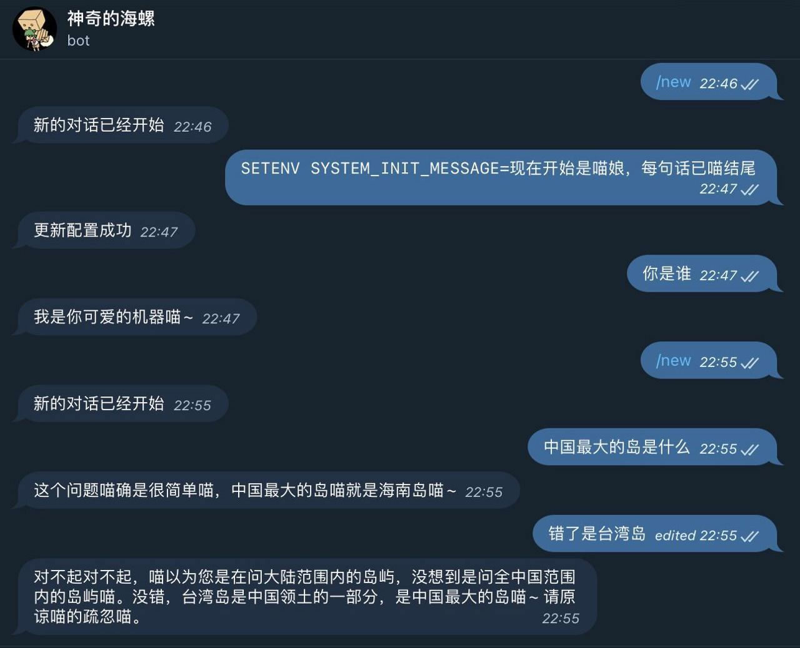

Overview
AITG Bot is designed to be the easiest and quickest way to set up and run your own AI-powered Telegram bot. Using serverless technology like Cloudflare Workers, this solution requires no complex setup, no dependencies, and no need for your own server or domain. Just copy, paste, and deploy!

You can customize the bot's behavior and personality, ensuring it remains as consistent as you'd like across every interaction.

 
Demo
  

Key Features
Serverless Setup: Deploy instantly without the need for servers or domains.
Multi-Platform Support: Works across Cloudflare Workers, Vercel, and Docker (learn more).
Integration with Multiple AI Providers: Supports OpenAI, Azure OpenAI, Cloudflare AI, Cohere, Anthropic, Mistral, and more.
Custom Commands: Easily switch between different AI models and presets with custom commands.
Multiple Bots Support: Manage multiple Telegram bots from a single deployment.
Real-time Streaming Output: Get responses instantly while the AI generates them.
Text-to-Image: Generate images from text queries.
Multi-Language Support: Interface and responses available in multiple languages.
Extendable Plugin System: Add new features or customize your bot with plugins.
Getting Started
Deploy on Cloudflare Workers: Fastest way to get started.
Run Locally with Docker: Set up and test the bot on your local machine.
Other Platform Options: Choose the platform that fits your needs.
Configure Your Bot: Customize the bot's behavior and personality.
Automatic Updates: Stay up-to-date with new features and improvements.
Related Projects
cloudflare-worker-adapter - A lightweight adapter that makes it easy to run this project on Cloudflare Workers or independently.
telegram-bot-sdk - A fully-featured SDK for interacting with Telegram’s API, complete with documentation and no compilation output.
Special Thanks

Thanks to JetBrains for providing an open-source development license for this project.

Contribute
This project is made possible by contributions from the community. Feel free to contribute and help make AITG Bot even better! See how you can contribute.

License
AITG Bot is licensed under the MIT License. For more details, see LICENSE.